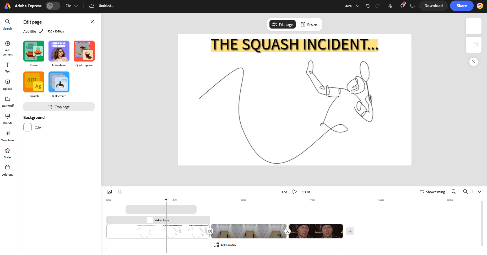

# Video and Image Editing With Adobe
This presentation, though textual, provides some information about how to get started with some of the Adobe Products. I've included the links and references at the start of the page, and I'd highly recommend looking at the Canvas page to get an idea of the tools that are available to Swinburne staff and students through the Adobe partnership, and some tutorials on how to use them.

## Links and references

| Link                                                                                                                                                       | Description                                                                                                                      |
| ---------------------------------------------------------------------------------------------------------------------------------------------------------- | -------------------------------------------------------------------------------------------------------------------------------- |
| [Canvas page at this link](https://swinburne.instructure.com/enroll/AM3Y6L)                                                                                | A great place to start if you want to learn about how to create. *The best resource on this list!*                               |
| [The Adobe + Swinburne Partnership](https://www.swinburne.edu.au/collaboration-partnerships/opportunities/achievements-success-stories/adobe-partnership/) | What is the partnership about                                                                                                    |
| [Swinburne's Digital Literacy Hub](https://sdlhub.org.au/about/)                                                                                           | Provides some information on where to get help, and how to book in consultation session with Adobe experts on campus and online. |
| [Adobe Digital Coach](https://sdlhub.org.au/support/)                                                                                                      | Booking Adobe Digital coaching, available 11am to 2pm, Tuesday through Friday.                                                   |
| [Adobe Express](https://new.express.adobe.com)                                                                                                             | A set of online tools you can use to create video, image or audio content.                                                       |
 
## Swinburne's Adobe Hub
Visit [Swinburne's Digital Literacy Hub](https://sdlhub.org.au/) to learn more about the partnership with Adobe, and what tools you have at your disposal.
There's an Adobe Hub on Campus, Level 3 of the Hawthorn Library, open between 11am and 2pm, Tuesday to Thursday.
- Get support (ask a question about an Adobe tool)
- Book a coach
	- Book a 1 on 1 session with a coach who has experience with the Adobe tool you need help with
	- This is actually probably what this CnC session should've been... But they only work Tuesday through Thursday
- Workshops (none on at the moment...)
- AI Community, where you can keep up to date with how creative jobs are being destroyed
Go to Canvas page, under `Get Support / Canvas Hub`
### Canvas Hub
Go to the [Canvas page at this link](https://swinburne.instructure.com/enroll/AM3Y6L).
- Courses specific to each Adobe App
- Broader courses on how to create media
	- Give a walkthrough of the apps you'll need to create that kind of media!
For tech support on Adobe things, get in touch with a [Adobe Digital Coach](https://sdlhub.org.au/support/).

## Adobe Express
[Here's a link to Adobe Express!](https://www.adobe.com/express/login)
### Sign in to Adobe Express
- Visit Adobe Express
- Click `Sign in` in top right corner
- Navigate to Student/Teachers
- Under `Sign-in or create account`, put in your student email address
- May be required to create a new account, but click `Company or School Account`

### Editing a simple photo with Photoshop
If you want a simple web interface for creating photos, with AI slop enabled features for generating content, the [Adobe online Photoshop](https://photoshop.adobe.com/) tool can get you started. Below is a very simple image you can create with Photoshop. For Photoshop tutorials (desktop app), you can visit the [Canvas page](https://swinburne.instructure.com/courses/27973/pages/starting-with-photoshop).
To create the simple image below, follow these steps:
- Insert a background image
- Test out the `Select` tool
	- Select a person in the background
	- Remove them (adios)
	- Or generative fill (AI slop time)
- Add some text with the `Type` tool
- Move the text to the desired location with the `Size & position` tool
- Add an ellipse with the `Shape` tool and move the ellipse layer behind the text
- Add a triangle, rotate it so a corner points diagonally, and move it into place
- Add in a new image (I'll refer to this as **img1**), move it and scale it to desired position
- Add in a new ellipse, move and scale it so it's the same size as the **img1**
- Move this new ellipse to the layer below the image you just added
- Right click on the **img1** layer and select `Create clipping mask`
- Click the `Download` button in the top right corner to download your image!

### Editing a simple video with Adobe Express
[Adobe Express](https://www.adobe.com/express) has some similar tools to Canva for creating videos, photos, documents and presentations. On the video front, it's fine for very simple videos, but is very limited in the types of files and formats, editing styles you would really need to create something usable! All the same, to get started:
- Find the `Ways to create` heading, and click Video
- In this menu, click the sub-heading `Standard videos`
- Drag and drop the video's you plan on using
	- These appear in the video timeline at the bottom of the screen, and the video preview appears above
- Scrub through the timeline by clicking the black vertical bar with the triangle above it
- Click and drag video clips to reorder them
- Click and drag from the edge of a clip to cut parts of the video
- Add new content from the `Add content` section
	- This can be images and videos, shapes, charts or AI generated content
- Click `Media` in the `Add content` section, and search for a stock image or footage
	- `Add as layer on canvas` will place it *over* existing footage 
	- `Add as scene in sequence` will add it as a new segment
- Click on the Video layer to add effects, speed it up, or change the volume
- Use the `Text` tool to add simple text graphics
	- The `Defaults` section can add simple text
- Select the text layer on the timeline, then in this menu
	- `Edit` will allow you to edit the text font, size, alignment etc.
	- `Effects` can give the text a drop shadow, glow etc.
	- `Animation` can animate how it appears, dissappears or give it a looping animation in the scene
- On the timeline, click the `+` symbol between two clips to create transitions
- Click the `Download` button in the top right corner to download your video!

## Premiere Pro
This is a complex piece of software, so I'd highly recommend watching some tutorials to see the things you can do with Premiere Pro. Once again, the [Canvas page](https://swinburne.instructure.com/courses/27973/pages/starting-with-premiere-pro) has some introductory content to get you started. The video demo that I gave at Cookies'n'Code includes some of the following information:
- Creating media bins
- The basics of the tools
- Adding effects
	- Image stabilisation with `Effects -> Video Effects -> Distort -> Warp Stabilizer`
	- Adjustment layers!
- Adding transitions
	- Under `Effects -> Video Transitions`, you can choose a sensible transition
- A more complicated transition...
	- The first video should be on the bottom channel
	- Have an image at the top channel, and using keyframes, have it pan across the screen for it's duration
	- In the middle channel, create an opacity mask and make the mask as big as the image frame
	- Now, scrub back to the start of the clip and click the click icon next to `Mask Path` to start keyframing
	- Using the `Track Selection Method Skip Forward One Frame`, you can gradually track the opacity mask with the object that is flying across the screen
- Change the speed of a clip by right clicking on it and selecting `Speed/Duration`
- Inserting text and using a mask
	- Create the text using the text tool
	- Under `Effects controls`, you can change how the text appears in the `Source Text` section
	- Create a mask, either an ellipse, rectangle or a bezier
	- Animate it by setting it's initial position, clicking the little clock icon to add a keyframe, scrubbing through the clip and setting it's final position and adding a new keyframe
- Render individual clips
	- Select the start of a clip (navigate using up and down arrows), press **I**, then to the end of a clip and press **O**, then press Control+M to send to media encoder or export in Premiere
- Add music by right clicking on your project folder panel, and selecting `Find Adobe Stock Audio`
- Apply audio transitions at the start and the end and you're done!
- Go to the `Export` heading to export the final video